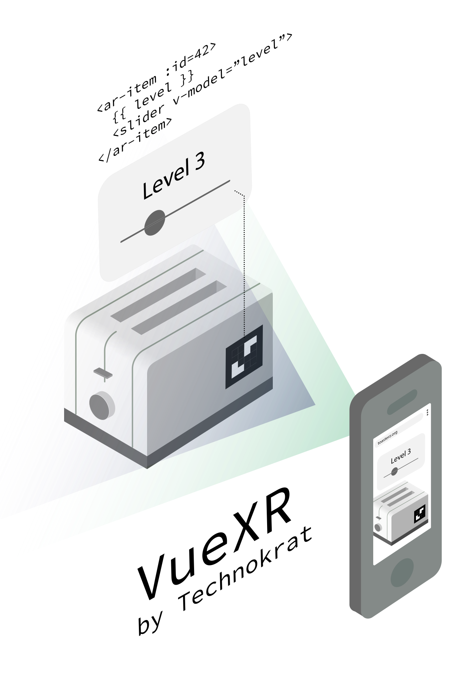

# VueXR
<a href="https://www.npmjs.com/package/vuexr"></a>
<a href="https://npmcharts.com/compare/vuexr?minimal=true"></a>
<a href="https://www.npmjs.com/package/vuexr"></a>



VueXR is a Vue plugin that let's you project regular DOM components onto **augmented reality** (AR) markers in real-time.

Supports Chrome 79+

See the official demo at [vuexr.technokrat.ch](https://vuexr.technokrat.ch). It is just as easy as:

```html
<ar-view>
  <ar-element :id="23">
    <div class="hello">Hello World!</div>
  </ar-element>
</ar-view>
```

With VueXR, you are able to build an AR-Prototype in minutes using your existing 2D web-application.
There is no need for you to dive into complex and hard to understand computer graphic topics – **just use your web development
skills!**

To achieve such functionality, VueXR uses *OpenCV.js*, *CSS-Transforms*, *Sensor API* and *Web Workers API* on a picture
stream from your device's camera. Have a look at our sources or contact me at [mw@technokrat.ch](mailto:mw@technokrat.ch)
or at https://technokrat.ch

## Getting Started

##### TLDR
1. Install `vuexr` package
2. `app.use(VueXR)`
3.
```
<ar-view>
  <ar-element :id="23">
    <div class="hello">Hello World!</div>
  </ar-element>
</ar-view>
```
4. Include `vuexr` styles:
```css
  @import 'vuexr';
```

**Access your application in a [secure context](https://w3c.github.io/webappsec-secure-contexts/) via HTTPS or `localhost` (e.g. doing port-forwarding)**

##### Elaborate

First install the `vuexr` npm package.

```sh
npm install vuexr

# or
# yarn add vuexr
```

Then add `VueXR` to your index.js (or index.ts)

```javascript
import {createApp, } from 'vue';

import {VueXR} from '../../src/vuexr';
import App from '../components/App.vue';

const app = createApp(App);
app.use(VueXR);
app.mount('#app');
```

Add the following inside your preferred component (e.g. *App.vue*)

```vue
<template>
    <ar-view>
      <ar-element :id="23">
        <div class="hello">Hello World!</div>
      </ar-element>
    </ar-view>
</template>

<script>
  export default {
    name: 'App',
  }
</script>

<style>
  @import 'vuexr';

  .hello {
    position: absolute;
    box-sizing: border-box;
    width: 50px;
    height: 50px;
    background: rgba(255,255,255,0.9);
    padding: 10px;
    font-size: 10px;
  }
</style>
```

You are now ready to test the application with a smartphone. **Remember that you have to connect in a [secure context](https://w3c.github.io/webappsec-secure-contexts/) via `HTTPS` or
`localhost` (e.g. by using the `chrome://inspect` port-forwarding feature) for VueXR to work. Accept the camera's permission request.

#### Calibration
For each new device we first need to calibrate the camera (i.e. automatically calculate the focal length), to project our
DOM elements with the correct perspective. Just display [this chessboard pattern](./vendor/pattern.png) on a different
screen, and try to fit all chessboard fields into the camera's view. VueXR will highlight the chessboard's intersection
points. Press the red *Capture Frame* button, and repeat this around eight times for different perspectives. Press the
*Calibrate* button when you are finished. You are now ready to detect the ArUco markers.

## Usage

### Performance
You have to use a state of the a smartphone device, such as a Xiaomi 20K / 9T Pro with MIUI 11, as computer vision takes it's fair share of processing power.

### General
In general, you only require two new components to use VueXR

* `<ar-view>` is our wrapper around the AR-session. It does initialize all required components for computer vision, camera,
and position tracking. It can contain arbitrarily many `<ar-element>`'s
* `<ar-element>` is the container around the content rendered onto a ArUco marker.
    * The `id` attribute (of type `Number`) is required and assigns a unique ArUco identifier.
    * The `timeout` attribute (of type `Number` in milliseconds, default `1000`) sets the time, a `<ar-element>` vanishes
    after it is not detected by the camera anymore
    * **(NOT SUPPORTED)** The `markerSize` attribute (of type `Number` in millimeters, default `50`) sets the size of the respective ArUco
    marker for accurate projection sizing.

#### Check support

If you need to determine dynamically whether your client supports VueXR before a session is established, use the
`$vuexr.check()` promise. E.g. you could write:

```vue
<template>
    <ar-view v-if="supported">
        // …
    </ar-view>
</template>

<script>
  import Vue from 'vue'

  const App = Vue.extend({
    data () {
      return {
        supported: false
      }
    },
    mounted () {
      this.$vuexr.check().then(({supported}) => {
        this.supported = supported;
      }).catch(() => {
        this.supported = false;
      })
    }
  });

  export default App;
</script>
```

### Markers
VueXR can detect **6x6** ArUco markers up to decimal ID `250`. They are quite robust, and encode orientation and identity
in one. Use this [generator webpage](http://chev.me/arucogen/) to print out a marker and stick it onto your toaster!

An `<ar-element>`'s origin is based in the middle of the marker. Use absolute positioning or CSS transforms to correctly
align the content.

### Nested Transformations
You might use nested transformations inside your `<ar-element>`'s content, e.g. `transform3d(10px, 20px 30px)`. Ensure to
set the CSS attribute `transform-style` to `preserve-3d` for all nested elements.

### Tracking State & Animations
By default, if a `<ar-element>` times out due to not being tracked anymore, it will fade out and it's content removed from the DOM.
See (https://vuejs.org/v2/guide/transitions.html#Transitioning-Single-Elements-Components).

If you want to handle things yourself, VueXR offers you a way to check if an `<ar-element>` is tracked from inside your
`<ar-element>`'s content using [Scoped Slots](https://vuejs.org/v2/guide/components-slots.html#Scoped-Slots)

Just use the following pattern to access the `tracked` property for a given `<ar-element>`:

```vue
<ar-view>
  <ar-element :id="50" v-slot:="{tracked}">
    <div class="hello" :class="{tracked: tracked}">
      Hello World!
    </div>
  </ar-element>
</ar-view>
```

Of course you are free to assign `tracked` to a sub-components property, use it for conditional rendering, and other
fun stuff (VueXR fully supports the reactive features of Vue).

To animate the content based on the `tracked` state, you are free to use CSS transitions and/or animations. E.g. you could
write

```vue
<style>
  .hello {
    position: absolute;
    background-color: rgba(255,255,255,0.9);
    transition: background-color 0.3s, color 0.3s;
  }

  .hello.tracked {
    background-color: red;
    color: white;
  }
</style>
```

### Sizing
One *millimeter* (*mm*) in real-world matches one *pixel* (*`px`*) in your `<ar-element>`, plain and simple.

### Calibration Pattern
Display [this chessboard pattern](./vendor/pattern.png) manually on a different screen, or use the `<ar-chessboard>`
component inside your Vue application. It will show an embedded image of the chessboard pattern.


## Demo
See the official demo at [vuexr.technokrat.ch](https://vuexr.technokrat.ch)

Or clone this repository and run

```sh
yarn install
yarn run demo:serve
```

You can now access a demo application of VueXR under `http://localhost:9000`. To see some AR-content point your camera
onto the AruCo marker with ID `42`.

## Contribution
### Future Work
* Rewrite JS to TypeScript and cleanup code
* Elaborate documentation on website
* More responsive position tracking
* DOM-Rendering in WebXR API
* Marker Scheme ID Attributes (allowing for future proof support of other marker systems)
* CI and Test Coverage

If you are interested in supporting this project contact me at [mw@technokrat.ch](mailto:mw@technokrat.ch)

## License
[MIT](./LICENSE)

Copyright (c) 2020. Markus Wegmann, [Technokrat LLC](https://technokrat.ch).

Technokrat LLC and the developers of VueXR are not liable for any damages in relation to the use or installment of VueXR.

## Inspiration

### Why AR?

#### Industry
Imagine, you could wander through an industrial hall with your smartphone, and directly see real-time sensor readouts
hovering in 3D over the machinery. With a simple touch press you then open up a detailed view.

You do not have to scroll through infinite pages of SCADA units on your computer in search for the specific machinery –
You are now directly linked via the physical entity itself.

Leaving you more ease-of-access, you benefit from less cognitive demand, so you can do your job more efficient.
Maybe you can even identify a failing component in advance, saving your company a lot.

#### Home Entertainment
You are a small company offering custom upper-class smarthome & home entertainment solutions. You want to offer your customers a custom
User Interface with next-generation features. With VueXR you can combine many already-existing web-solutions into one surface. No problem for VueXR!

### Why VueXR?
Conventional AR requires a lot of expertise in building native smartphone applications for a multitude of platforms,
requiring hard to get specialists.

For small and large businesses this poses a very large financial and personnel undertaking, while having bad time to market performance.

In contrast, VueXR allows you to prototype a solution in no time, by leveraging the ease, accessibility, and mutli-platform
capabilities of modern web technologies, as well as your existing web codebase: You only have to write your code once!


### Why [Technokrat](https://technokrat.ch)?
[Technokrat](https://technokrat.ch) is a full-stack engineering service by ETH-alumni in Zurich, Switzerland, and is the maintainer behind VueXR.

Our strength lies in the combination of research, electronics design, firmware, IoT, computer engineering, manufacturing,
and **software development**.

We can offer you a one-stop experience in upgrading (legacy) setups to AR, or start from the beginning, and consult you and your team
in bootstraping and selecting the best competitive solution. We also integrate Web-APIs directly into your existing software (such as REST, GraphQL, SOAP, Swagger, etc.). Just give us a call and we support you with a **workshop or MVP in just under six weeks**.
